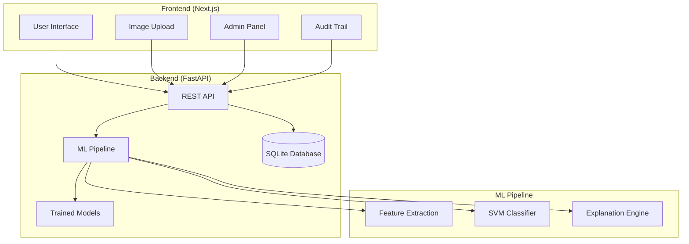

# Design Document

## Overview

CatalogAI - Authenticity Detection is a full-stack web application that uses computer vision and machine learning to detect AI-generated or synthetic product images. The system employs a microservices architecture with a Python FastAPI backend for ML processing and a Next.js frontend for user interaction.

The core detection algorithm extracts interpretable features from images (edge patterns, color statistics, compression artifacts, noise characteristics) and uses a Support Vector Machine classifier to distinguish between authentic and synthetic images. The system is designed to run entirely on CPU without external dependencies.

## Architecture

### System Architecture



### Technology Stack

**Backend:**
- Python 3.11 with FastAPI for high-performance async API
- SQLModel with SQLite for data persistence
- scikit-learn for machine learning (SVM classifier)
- OpenCV (headless) and Pillow for image processing
- Uvicorn as ASGI server

**Frontend:**
- Next.js 14 with App Router for modern React development
- TypeScript for type safety
- TailwindCSS with shadcn/ui for consistent UI components
- Axios for API communication

**Infrastructure:**
- Docker and docker-compose for containerization
- GitHub Actions for CI/CD
- Ruff for Python linting, ESLint/Prettier for frontend

## Components and Interfaces

### Backend Components

#### 1. Configuration Management (`config.py`)
- Environment-based configuration loading
- Default values for all settings
- Validation of configuration parameters

```python
class Settings:
    db_url: str = "sqlite:///app.db"
    thresh_auth: float = 0.15
    thresh_syn: float = 0.70
    max_image_mb: int = 8
    log_level: str = "INFO"
```

#### 2. Database Layer (`db.py`, `models.py`)
- SQLModel entities for data persistence
- Scan records with metadata and results
- Threshold configuration storage

**Scan Model:**
```python
class Scan(SQLModel, table=True):
    id: Optional[int] = Field(primary_key=True)
    filename: str
    size: int
    mime_type: str
    score: float
    label: str
    reasons: str  # JSON array
    created_at: datetime
```

#### 3. ML Pipeline (`pipeline/`)

**Feature Extraction (`features.py`):**
- Edge density using Canny edge detection
- Sharpness via Laplacian variance
- Color histogram statistics and entropy
- JPEG compression artifact detection
- Noise estimation using wavelet analysis
- Texture periodicity via FFT analysis

**Classification (`classifier.py`):**
- SVM with RBF kernel and balanced class weights
- Probability calibration for confidence scores
- Model persistence using joblib
- Automatic retraining capabilities

**Explanation Engine (`reasons.py`):**
- Maps feature anomalies to human-readable explanations
- Provides actionable feedback for improvement
- Contextual reasoning based on classification confidence

#### 4. API Routes (`routers/`)
- Health check endpoint
- Image scanning with multi-file upload
- Scan history with pagination
- Admin threshold management
- Model retraining endpoint

### Frontend Components

#### 1. Core Pages
- **Upload Page (`/`):** Drag-and-drop interface with real-time results
- **Admin Page (`/admin`):** Threshold configuration and model management
- **Audit Page (`/scans`):** Historical scan data with filtering

#### 2. Reusable Components
- **Uploader:** Multi-file drag-and-drop with progress tracking
- **ScoreBadge:** Color-coded authenticity indicators
- **ThresholdEditor:** Real-time threshold adjustment with preview
- **PreviewGrid:** Image thumbnails with classification results

#### 3. API Integration (`api.ts`)
- Centralized Axios client with error handling
- Type-safe request/response interfaces
- Automatic retry logic for failed requests

## Data Models

### Feature Vector Structure
The system extracts a fixed-length feature vector (approximately 20-30 dimensions) from each image:

1. **Edge Features (4 dimensions)**
   - Canny edge density
   - Laplacian variance (sharpness)
   - Gradient magnitude statistics

2. **Color Features (9 dimensions)**
   - RGB histogram moments (mean, std, skew per channel)
   - HSV saturation and brightness statistics
   - Color entropy

3. **Compression Features (6 dimensions)**
   - JPEG quantization proxy via DCT analysis
   - Block artifact detection
   - Compression ratio estimation

4. **Noise/Texture Features (8 dimensions)**
   - Wavelet-based noise estimation
   - Bilateral filter residual energy
   - FFT-based texture periodicity
   - Local variance patterns

### Classification Labels
- **0 (Authentic):** p_synthetic < 0.15
- **1 (Suspicious):** 0.15 ≤ p_synthetic < 0.70
- **2 (Synthetic):** p_synthetic ≥ 0.70

### Database Schema

**Scans Table:**
```sql
CREATE TABLE scans (
    id INTEGER PRIMARY KEY AUTOINCREMENT,
    filename VARCHAR NOT NULL,
    size INTEGER NOT NULL,
    mime_type VARCHAR NOT NULL,
    score REAL NOT NULL,
    label VARCHAR NOT NULL,
    reasons TEXT NOT NULL,
    created_at TIMESTAMP DEFAULT CURRENT_TIMESTAMP
);
```

## Error Handling

### Backend Error Handling
1. **Image Processing Errors:**
   - Invalid file formats → 400 Bad Request
   - Corrupted images → 422 Unprocessable Entity
   - File size limits → 413 Payload Too Large

2. **ML Pipeline Errors:**
   - Feature extraction failures → Fallback to basic classification
   - Model loading errors → Automatic retraining trigger
   - Classification timeouts → Graceful degradation

3. **Database Errors:**
   - Connection failures → Retry with exponential backoff
   - Constraint violations → Detailed validation messages
   - Migration errors → Rollback and error logging

### Frontend Error Handling
1. **Upload Errors:**
   - Network failures → Retry mechanism with user feedback
   - File validation → Client-side pre-validation
   - Server errors → User-friendly error messages

2. **API Communication:**
   - Timeout handling with loading states
   - Offline detection and queuing
   - Rate limiting with user notification

## Testing Strategy

### Backend Testing
1. **Unit Tests:**
   - Feature extraction determinism
   - Classification accuracy on known samples
   - API endpoint functionality
   - Database operations

2. **Integration Tests:**
   - End-to-end image processing pipeline
   - API contract validation
   - Database migration testing

3. **Performance Tests:**
   - Image processing latency benchmarks
   - Concurrent request handling
   - Memory usage profiling

### Frontend Testing
1. **Component Tests:**
   - UI component rendering
   - User interaction handling
   - API integration mocking

2. **E2E Tests:**
   - Complete user workflows
   - Cross-browser compatibility
   - Responsive design validation

### Seed Data Generation
The system includes programmatic generation of training data:

1. **Synthetic Images (60 samples):**
   - Procedural patterns with uniform lighting
   - Over-smoothed textures
   - Artificial color gradients
   - Minimal noise characteristics

2. **Authentic Images (60 samples):**
   - Natural lighting variations
   - Realistic texture patterns
   - Camera noise simulation
   - Perspective distortions

### Model Training Pipeline
1. **Data Preparation:**
   - Automated seed data generation
   - Feature extraction and normalization
   - Train/validation split (80/20)

2. **Model Training:**
   - SVM with RBF kernel
   - Grid search for hyperparameter optimization
   - Cross-validation for robust evaluation

3. **Model Evaluation:**
   - Accuracy, precision, recall metrics
   - ROC curve analysis for threshold selection
   - Feature importance analysis

### Deployment Architecture

**Docker Compose Services:**
1. **Backend Service:**
   - Python 3.11-slim base image
   - Volume mounts for model persistence
   - Health checks and restart policies

2. **Frontend Service:**
   - Node 20-alpine base image
   - Multi-stage build for optimization
   - Static file serving

**Development Workflow:**
1. Local development with hot reloading
2. Docker-based testing environment
3. CI/CD pipeline with automated testing
4. Production deployment with health monitoring

This design ensures a scalable, maintainable, and production-ready system that meets all specified requirements while providing clear separation of concerns and robust error handling.